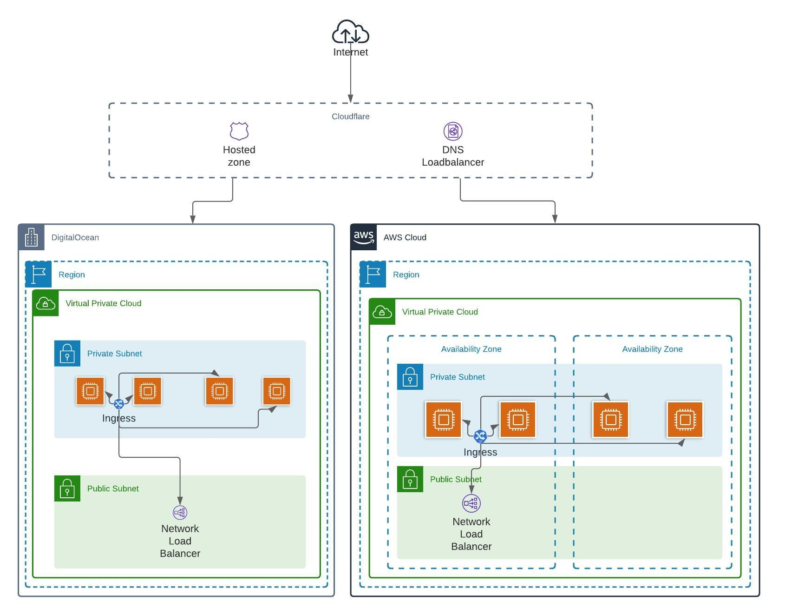

# Botney trap

I invoked the cloud superpowers and two of them attended the call. AWS is one of the most powerful players in the cloud environment. Digitalocean is very flexible and simple. Cloudflare is the DNS load balancer to "spill out" the traffic. The mix of these powers leads to the birth of a superweapon against the Basherbot.

<br>

---

<br>

## Steps to installation:

### Prerequisites

- [GNU Make][3] - Version 4.2
  - MacOS and Linux users will have a suitable version bundled with the OS
- Bourne Shell and POSIX tools (sh, grep, sed, awk, etc)
  - MacOS and Linux users will have a suitable version bundled with the OS
- [Git][5]
- [Docker][0] | [Docker for Mac][1] | [Docker for Windows][2]
- [AWS account keys][4]
  - Create an IAM role with admin permissions https://docs.aws.amazon.com/IAM/latest/UserGuide/id_roles_create.html
- [Digitalocean Account keys][6]
  - You have to create an API token https://docs.digitalocean.com/reference/api/create-personal-access-token/
- [Cloudflare Account keys][7]
  - It's necesarry to provide the global api key https://support.cloudflare.com/hc/en-us/articles/200167836-Managing-API-Tokens-and-Keys#12345682
  - Provide the email
  - You have to activate the loadbalancing feature https://www.cloudflare.com/load-balancing/

<br>

### Environment variables

If you want to create a custom environment variable before you start the project, you have to change the .env.example file present on the root directory.
That way when you start the project docker is going to read that configuration and start the containers with the variables provided.

If you already started the project you can change the .env file manually. If the file doesn't exist you can type make in console to configure the image. Then you can set the environment variables in the .env file.

```
AWS_SECRET_ACCESS_KEY=AWS_SECRET_ACCESS_KEY
AWS_ACCESS_KEY_ID=AWS_ACCESS_KEY_ID
DIGITALOCEAN_ACCESS_TOKEN=DIGITALOCEAN_ACCESS_TOKEN
CLOUDFLARE_API_KEY=CLOUDFLARE_API_KEY
CLOUDFLARE_EMAIL=CLOUDFLARE_EMAIL
```

### How to run the project

If the `make` command fails at some point, you can rerun it.

1. Configure docker image

```sh
make
```

2. Configure the env vars in the .env file

3. Init configuration

```sh
make init
```

4. Once the configuration was created successfully you can deploy the infrastructure.

```sh
make infra
```

5. If the infrastructure was deployed you have to set the DNS sever names in you domain provider.

6. After that you can deploy the application.

```sh
make deploy
```

7. After a few minutes the domain should be available. Try to go to your subdomain depending on your environment.

## <br>

⚠️ **BE CAREFUL** ⚠️ the whole infrastructure is deployed with docker to avoid you install too much dependencies like terraform, AWS CLI, DO CLI, kustomize, kubectl, etc. Having said that I use docker volume to persist terraform's state. Don't clean the volume before to destroy the infrastructure because terraform would initiate another instance of the state which means you have to delete your created infrastructure manually.

## <br>

### Project Commands

These are the available `make` commands in the root directory.

| Command        | Description                                                                      |
| -------------- | -------------------------------------------------------------------------------- |
| `make`         | Build configuration and create docker image                                      |
| `make init`    | Bootstraps the init configuration                                                |
| `make infra`   | Deploy the infrastructure with the configuration provided in the make init step. |
| `make deploy`  | Deploy the application with the configuration provided in the make init step.    |
| `make destroy` | Destroy the whole infrastructure                                                 |
| `make clean`   | Clean docker volumens                                                            |
| `make list`    | Example: `make list`. List all available commands                                |

## Demo:

You can see the demo (here)[https://www.loom.com/share/badf69716b744f95ae18fba3eb106044]

## <br>

---

<br>

## The Infinity Sources powers:

I used the power of Kubernetes to deploy the botney trap across cloud providers. I chose Kubernetes because it's prepared to scale, it’s cloud-native and we can create multiple namespaces to isolate environments.

I used an agnostic API gateway to configure the ingress [ambassador](https://www.getambassador.io/docs/edge-stack/latest/topics/concepts/kubernetes-network-architecture/). I chose ambassador ingress because it is agnostic so I can reuse it between cloud providers. Also, it configures a TCP load balancer and it's created on top of envoy.

I used kustomize to handle deployments and configuration manifests [more info here](https://kustomize.io/)

<br>



<br>

- **Space:**: Thanks to the CLI you can configure any cloud you want. There are two supported clouds at the moment but the configuration is very agnostic, so it could be possible to add a new cloud provider relatively easily.

- **Mind:**: We can configure many environments with the CLI. There are two by default; development and production.

- **Reality:**: We are using docker and semantic releases to keep track of changes in the botneytrap. It's relatively straightforward to track changes because we are using infrastructure as code. The only change we need to do here is to create a global state to share between different botney trap operators. The default state is created locally when we run our trap.

- **Power:**: We are using a DNS load balancer to "spill out" traffic between different providers. We are using Cloudflare to do this but we can create our own DNS server to accomplish the same goal. I chose Cloudflare because it's easier than implementing the whole DNS provider. Also, it brings a lot of other benefits that I will explain further in this doc.

We can configure our trap in different providers but for now, it's limited to spill out the traffic with a unique configuration in weight for all environments, which means that you can not configure a different weight for production and different weight for development. The weight configuration is done when you deploy the trap and it is shared across all environments.

- **Time:**: We are using git and semantic versioning to package our app. Also, we use terraform as a configuration tool for our trap so we have management of the state of the infrastructure. It's quite simple at the moment but with Terraform we can iterate to accomplish full traceability of the process.

- **Soul:**: All communications are protected by SSL. This is provided by Cloudflare. Also, we have control of how to deploy our traps per environment. We can configure our endpoints and domain names. There are some improvements to be made. For instance, the SSL protection ends in Cloudflare. We must create SSL protection from Cloudflare to our infrastructure.

<br>

---

<br>

## Testing

Our trap is continuously testing thanks to the GitHub actions (CI). Different tests are applied when a new push is created to the repo. We are testings:

- Bash scripts
- Javascript files
- Docker linting
- Terraform security configuration best practices
- Yaml linting

These are quite simple but it's a good practice to keep code quality. For now, there is no end-to-end testing but we can implement it easily. We can use something like https://terratest.gruntwork.io/ to automate that process. Also, we can test our trap with e2e tests.

It's quite difficult to separate concerns here because all repos are mixed. I would prefer to separate configuration repos from app repos.

<br>

---

<br>

## Weakness

At the security level, we can be sure that it is kinda difficult for the Basherbot to attack us. We create a VPC configuration to deploy our trap so it's isolated. We used Cloudflare which provides DosAttack prevention and we can create other mechanisms to avoid possible attacks like WAFs that are also provided by Cloudflare.

We don't have fully SSL termination so that could be a weakness in our approach. Also, we don't have TLS encryption inside the cluster. I tried to implement this with service mesh (https://www.consul.io/docs/k8s) but it was too much work to do in a short period of time, but you can check the **folder** terraform/modules/old.

There were some weaknesses in the docker file which I fixed. First, we were using root to run our service. That's not a very good practice. I understand that docker creates an isolated environment for each service but running a process as root could permit exploitation vulnerabilities.

I also fixed a well-known vulnerability when we are using node. I used **RUN npm ci --only=prod --ignore-scripts** to install our packages and to disable the post-installation scripts. You can check [this](https://blog.npmjs.org/post/141702881055/package-install-scripts-vulnerability.html) up if you are interested to know more details.

One last thing I was concerned about was to run our trap with a PID 1 handler to avoid zombie processes. It's a good idea when you are using docker. I used (tini)[https://github.com/krallin/tini] as a process handler.

_Do you think it could be an unknown vulnerability unmentioned in this approach? open an issue and I will address the problem. Thanks ;)_

<br>

---

<br>

### Bonus/optional

**certificate management**

I delegated the certificate management to Cloudflare. I just need to configure my domain with the proper DNS name servers. But I would use something like certmanager to manage certificates between Cloudflare and our infrastructure. I tried indeed but I ran out of time (you can check to terraform/modules/old).

**renewal of DNS and certificates if necessary**

We can configure our DNS through terraform. Those scripts take the ip of each cloud provider and can configure the DNS. Each time we deploy, terraform would take care to keep updated our DNS configuration in case some IP is released or updated. Certificate renewal is handled by cloudflare but in case we implement certmanager in our cluster, it will handle that part with letsencrypt.

**policy enforcement at the cloud-user level and at deploy time**

The best way to implement this is to separate concerns between app and infrastructure.

I would separate configuration in another repo and enforce deployment policies at the CI/CD level. I would deploy only through CI/CD to handle a global state. If an operator wants to change something, that has to be done through the CI/CD pipeline. Obviously, they can deploy to their own cloud providers with their own credentials or at least with testing credentials.

On the other hand, I would separate the app in another repo to handle infrastructure deployments. I would use terraform to get the proper endpoints and credentials of the deployed infrastructure. I would implement Gitops with [argoCD](https://argoproj.github.io/argo-cd/) or [flux](https://fluxcd.io/).

That allows me to enforce different kinds of policies and it gives us (me and my team) the proper separation of concerns to work together.

**DDoS attacks**

Because we are using cloudflare to access our services, there is a layer that protects us from DDoS attacks. Cloudflare uses CDN’s around the world to cache assets and responses of different services. So we are not exposing our service directly to the internet. Also, we can use some policies at the ingress level like [rate limiting](https://www.getambassador.io/learn/kubernetes-glossary/rate-limiting/).

<br>

---

<br>

## describe what your "roadmap of improvement" would look like

The first thing I would focus on is the CLI.

For now, it's very simple. I used node to implement it but one improvement could be to create an npm package just for the cli. That creates a separation of concerns and we can re-use that package across projects.

The second thing is to fully support SSL encryption. I talked about that in previous steps.

The third one is the separation of concerns (separation of configuration from the app). It's difficult to work in a team with this configuration so that would be a must for me.

Another improvement is to implement a gitops approach to deploy our apps.

The last one is to create a terraform end-to-end test pipeline. Terraform is the heart of our implementation so it's super important to be sure that it works as expected.

[0]: https://www.docker.com/get-docker "Docker"
[1]: https://www.docker.com/docker-mac "Docker for Mac"
[2]: https://www.docker.com/docker-windows "Docker for Windows"
[3]: https://www.gnu.org/software/make/ "Make"
[4]: https://signin.aws.amazon.com/ "AWS account"
[5]: https://git-scm.com/ "Git"
[6]: https://git-scm.com/ "Digitalocean Account"
[7]: https://www.cloudflare.com/ "Cloudflare Account"
