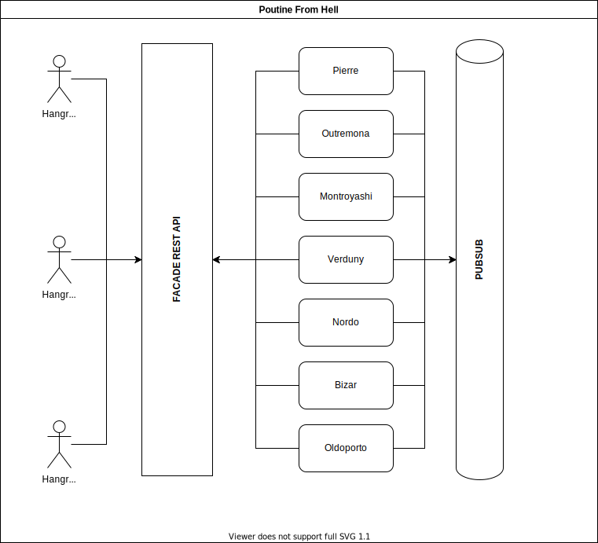

# Poutine Robots From Hell

## Run locally

### Prerequisites

- [Docker](https://docs.docker.com/get-docker/)
- [Docker-Compose](https://docs.docker.com/compose/install/)

Then run in this directory:

```bash
docker-compose up
```

## System Architecture

We use [Redis](https://redis.io/) to implement a Publish/Subscribe network between robots. This allow them to communicate/collaborate together. Robots also have a REST API for some tasks like taking an order, see the status of an order or adjusting some settings. Ideally, a "facade" API would be created to ensure ease of use for a front end. This would prevent having to understand/know what each robot is doing. This is not implemented at the moment...

### Architecture diagram




## Robots API

On top of what follows, each robots has a `GET /healthcheck` endpoint to ensure they are up.

### Pierre

He is the "orchestrator". He takes the order and keeps tracks of them. He is also the one responsible for inventory checks (this potentialy should be it's own service).

#### Publishes

- order-received
- squeezed-cheese-received
- gravy-scoops-received
- fried-potatoes-received
- mixing-ingredients-start
- mixing-ingredients-finished
- order-timeout
- order-ready

#### Subscriptions

- squeezed-cheese-ready
- gravy-scoops-ready
- fried-potatoes-ready


#### REST API

```
POST /orders

Request body
{
    "size"              : "small|medium|large",
    "potato"            : "yellow|white|red|sweet",
    "potato_cut"        : "1x1|2x2|3x3",
    "potato_dip"        : "maple-syrup",
    "potato_softness"   : "raw|softish|mushy",
    "cheese"            : "couic-couic|not-so-good",
    "oil"               : "sunflower|olive|valvoline",
    "gravy"             : "secret|tequila"
}

Note: All fields are optional and by default you'll get a large poutine with yellow potatoes,
1x1 cut, maple syrup dip, softish boiled, fried in sunflower oil, couic-couic cheese and secret gravy.

Response
{
    "id": "my-order-id"
}
```


```
GET /orders/[order-id]

Sample return
{
    "id": "F1CECA",
    "received": "2020-11-11T14:08:45.498145235Z",
    "status": "pending",
    "size": "large",
    "potato": "yellow",
    "potato_cut": "1x1",
    "potato_dip": "maple-syrup",
    "potato_softness": "softish",
    "cheese": "couic-couic",
    "oil": "sunflower",
    "gravy": "secret"
}
```

### Outremona

Takes care of picking and squeezing cheese curds.

#### Publishes

- squeezed-cheese-ready
- cheese-screams

#### Subscriptions

- order-received

### Montroyashi

Diplay Leonard Cohen lyrics when it hears the cheese screaming and it detect drunk people. Drunk people use tequila as gravy...

#### Publishes

- leonard-cohen-lyrics
- drunk-people

#### Subscriptions

- order-received
- cheese-screams

### Verduny

Picks the right potatoes, cut them in the right size and dip them in the right dip!

#### Publishes

- cutted-potatoes-start
- cutted-potatoes-ready
- dipped-potatoes-start
- dipped-potatoes-ready

#### Subscriptions

- order-received

### Nordo

Boils potatoes to the right softness level

#### Publishes

- boiled-potatoes-start
- boiled-potatoes-ready
- dipped-potatoes-start
- dipped-potatoes-ready

#### Subscriptions

- order-received
- dipped-potatoes-ready

#### REST API

```
GET /orders/:id/softness

Response
"raw|softish|mushy"
```

### Bizar

Fries potatoes and sing some lyrics to them afterward.

#### Publishes

- fried-potatoes-start
- singing-leonard-cohen
- fried-potatoes-ready

#### Subscriptions

- order-received
- boiled-potatoes-ready
- leonard-cohen-lyrics

### Oldoporto

Keep gravies to the right temperature and distribute some delicious gravy scoops

#### Publishes

- gravy-scoops-start
- gravy-scoops-ready

#### Subscriptions

- order-received

#### REST API

```
GET /gravies/[secret|tequila]/temperature

Response
98.0

POST /gravies/[secret|tequila]/temperature/:temperature

Response
HTTP 200 OK
```