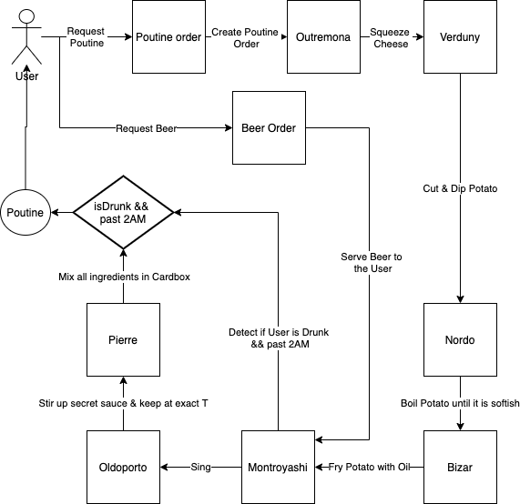

# RoboMaker

The Backend for the RoboMaker challenge 
designed and implemented by Mazen Amr Eid.

## Backend Design

I designed every robot as a microservice. 
To showcase my skills, instead of exposing every robot to its API endpoint (which is the easy implementation to do), 
I preferred to create a microservices architecture where the communication between the robots is fully integrated inside the backend.
In fact, they communicate using Apache Kafka using the Producer Consumer communication. <br>
I used The following components (they can be found in the docker-compose file):
- Prometheus
- Grafana
- Cadvisor
- Mongodb
- Redis
- Nginx
- Kafka
- Zookeeper

### Databases ###
#### Mongodb ####
I used Mongodb as the non relational database engine where I have a collection for the following entities:
- User
- Cheese
- Potato

#### Redis ####
I used Redis as the in memory database to store & process pending orders

### Data Flow ###


- Every square is a microservice.
- Stick Man is the user
- Ellipse is the final poutine object

### Containers Integrated ###
#### Grafana ####
Running on localhost:3000. Used for monitoring

#### Prometheus ####
Running on localhost:9090. Used for monitoring

#### CAdvisor ####
Running on localhost:8080. Used for containers resources monitoring

#### Ngnix ####
running on localhost:80

#### Mongodb ####
Running on localhost:27017. Used as a non-relational database

#### Redis ####
Running on localhost:6379. Used as in-memory database

#### Kafka ####
Running on localhost:9092. Used for microservices communication

#### Zookeeper ####
Running on localhost:2181. Used along with Kafka

### Assumptions & Limitations ###

- I assumed that there is an unlimited inventory of every ingredient (cheese, potatoes, secret sauce, etc.)
- I would have loved to have more time, but since I did not have enough time, I didn't: 
    - create a Front End
    - create a test suite

## Running / Development & How to Use
* make sure docker is running
* `docker-compose up`
* `npm run dev`
* wait for a minute so that all microservices are up and running. 
When the backend is fully booted, you should see a log saying " BOOT :: <> <> <> <> <> <> <> <> <> <> Listening on 0.0.0.0:3030 <> <> <> <> <> <> <> <> <> <>
".
* To create a Poutine order, send a request to localhost:3030/v1/order/:userid&:oil (example: localhost:3030/v1/order/10&olive)
* you will see the order being processed by the robots in the backend
* To get drunk, send a request 4 times to localhost:3030/v1/beer/:userid (example: localhost:3030/v1/beer/10). 
Please note that in order to request a Beer order, the user should already have created a Poutine order, i.e. the userid matches exactly the same one made when requesting Poutine.
* Pierre will then send the Poutine to a topic named "people" meaning that the Poutine is ready

### Typical Log (Ignoring Booting Log) from the usage above ###
```
 [Node] [INFO] - 11/6/2020, 7:08:17 AM,363 - ORDER:: Received Poutine Order...
 [Node] [DEBUG] - 11/6/2020, 7:08:17 AM,400 - KAFKA PRODUCERS :: Connected to 127.0.0.1 ready for publishing on topic outremona
 [Node] [DEBUG] - 11/6/2020, 7:08:17 AM,462 - KAFKA PRODUCERS :: Connected to 127.0.0.1 ready for publishing on topic beer
 [Node] [INFO] - 11/6/2020, 7:08:17 AM,516 - Order Published to Outremona!
 [Node] [INFO] - 11/6/2020, 7:08:17 AM,636 - Outremona: Took Cheese
 [Node] [INFO] - 11/6/2020, 7:08:18 AM,678 - Outremona: Squeezed Cheese
 [Node] [INFO] - 11/6/2020, 7:08:18 AM,747 - outremona:: Passed order to verduny ;)
 [Node] [INFO] - 11/6/2020, 7:08:18 AM,752 - Verduny: Received Order...
 [Node] [INFO] - 11/6/2020, 7:08:18 AM,762 - Verduny: Cut Potato in 1x1x1 dimensions
 [Node] [INFO] - 11/6/2020, 7:08:18 AM,770 - Verduny: Dipping Potato in maple syrup for 25 seconds...
 [Node] [INFO] - 11/6/2020, 7:08:43 AM,816 - Nordo: Received Order...
 [Node] [INFO] - 11/6/2020, 7:08:43 AM,817 - Nordo: Boiling Potato
 [Node] [INFO] - 11/6/2020, 7:08:43 AM,830 - verduny:: Passed order to nordo ;)
 [Node] [INFO] - 11/6/2020, 7:08:44 AM,830 - Nordo: Potato is now softish
 [Node] [INFO] - 11/6/2020, 7:08:44 AM,878 - nordo:: Passed order to bizar ;)
 [Node] [INFO] - 11/6/2020, 7:08:44 AM,893 - Bizar: Received Order...
 [Node] [INFO] - 11/6/2020, 7:08:45 AM,903 - Bizar: Fried Potato with olive oil
 [Node] [INFO] - 11/6/2020, 7:08:45 AM,933 - bizar:: Passed order to montroyashi ;)
 [Node] [INFO] - 11/6/2020, 7:08:45 AM,943 - Montroyashi: Received Order...
 [Node] [INFO] - 11/6/2020, 7:08:45 AM,943 - Montroyashi: lyric1
 [Node] [INFO] - 11/6/2020, 7:08:45 AM,989 - montroyashi:: Passed order to oldoporto ;)
 [Node] [INFO] - 11/6/2020, 7:08:46 AM,5 - Oldoporto: Received Order...
 [Node] [INFO] - 11/6/2020, 7:08:47 AM,10 - Oldoporto: Stirred up the secret gravy sauce
 [Node] [INFO] - 11/6/2020, 7:08:48 AM,10 - Oldoporto: Keeping the gravy sauce at exact temperature before boiling
 [Node] [INFO] - 11/6/2020, 7:08:48 AM,58 - oldoporto:: Passed order to pierre ;)
 [Node] [INFO] - 11/6/2020, 7:08:48 AM,63 - Pierre: Received Order...
 [Node] [INFO] - 11/6/2020, 7:08:49 AM,72 - Pierre: Mixed up all of the fried potatoes, gravy and cheese into a cardboax
 [Node] [INFO] - 11/6/2020, 7:09:07 AM,853 - ORDER:: Received Beer Order...
 [Node] [INFO] - 11/6/2020, 7:09:07 AM,886 - Beer Order Published to Montroyashi!
 [Node] [INFO] - 11/6/2020, 7:09:08 AM,20 - Montroyashi: User drunk a beer...
 [Node] [INFO] - 11/6/2020, 7:09:14 AM,166 - ORDER:: Received Beer Order...
 [Node] [INFO] - 11/6/2020, 7:09:14 AM,245 - Montroyashi: User drunk a beer...
 [Node] [INFO] - 11/6/2020, 7:09:14 AM,254 - Beer Order Published to Montroyashi!
 [Node] [INFO] - 11/6/2020, 7:09:17 AM,788 - ORDER:: Received Beer Order...
 [Node] [INFO] - 11/6/2020, 7:09:17 AM,824 - Beer Order Published to Montroyashi!
 [Node] [INFO] - 11/6/2020, 7:09:17 AM,974 - Montroyashi: User drunk a beer...
 [Node] [INFO] - 11/6/2020, 7:09:20 AM,753 - ORDER:: Received Beer Order...
 [Node] [INFO] - 11/6/2020, 7:09:20 AM,789 - Beer Order Published to Montroyashi!
 [Node] [INFO] - 11/6/2020, 7:09:20 AM,927 - Montroyashi: User drunk a beer...
 [Node] [INFO] - 11/6/2020, 7:09:20 AM,972 - beer:: Passed order to userReady ;)
 [Node] [INFO] - 11/6/2020, 7:09:21 AM,16 - pierre,userReady:: Passed order to people ;)
 [Node] [INFO] - 11/6/2020, 7:09:21 AM,16 - Pierre: Sent order to needy user!
 ```

### Prerequisites ###

You will need the following things properly installed on your computer.

* [Git](http://git-scm.com/)
* [Node.js](http://nodejs.org/) - Version v8.9.0 (with NPM)
* Docker

## Installation

* `git clone <this-repository-url>`
* change into the new directory
* `npm install`


## Build

`npm run build`

Uses Gulp [Gulp](https://gulpjs.com/) for TypeScript build

#### FOLDER STRUCTURE

```
config
└───prod
│   prod_config
└───test
│   test_config
└───uat
│   uat_config
deployment
locales
│   english-us
logger
│   winston-logger-setup  
src
└───boot
│   └───initializers
│         initializer-1
│         initializer-2
│         ...
│   boot-file
└───controllers
│     controller-1
│     controller-2
│     ...
└───middlewares
│     middleware-1
│     middleware-2
│     ...
└───models
│     model-1
│     model-2
│     ...
└───routes
│     route-1
│     route-2
│     ...
└───services
│     service-1
│     service-2
│     ...
└───utils
│     util-1
│     util-2
│     ...
└───tests
│     test-1
│     test-2
│     ...
```

## Limitations

